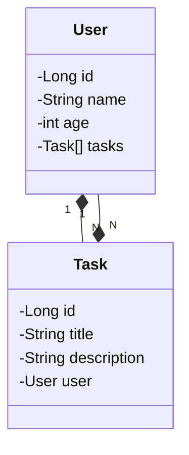

#  API de Gerenciamento de Tarefas (To-Do List)
Uma API RESTful desenvolvida em Java com Spring Boot para gerenciar uma lista de tarefas. Esta aplicação deverar criar, ler, atualizar e excluir tarefas, categorias e usuários.

## Diagrama de Classes (Domínio da API)

## LINK API

[https://gerenciamento.up.railway.app/swagger-ui/index.html](https://gerenciamento.up.railway.app/swagger-ui/index.html)
